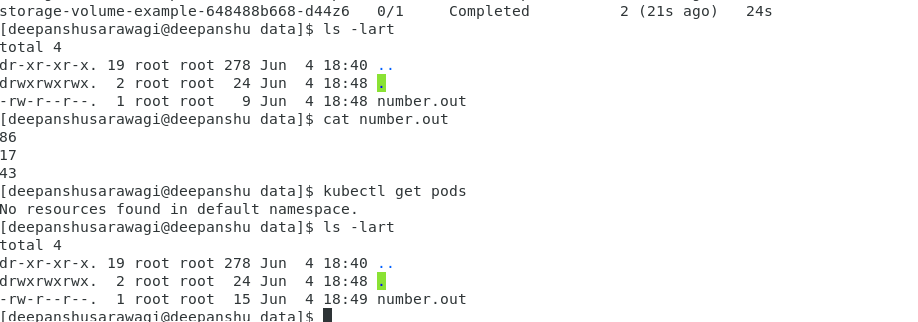

# Storage in Kubernetes

## Table of contents:

1. [Storage in Docker](#1-storage-in-docker)
   1. [Docker's Layered Architecture](#1a-dockers-layered-architecture)
   2. [Persistent storage in Docker](#1b-persistent-storage-in-docker)
2. [Volumes](#2-volumes)
   1. [Persistent Volumes](#2a-persistent-volumes)
   2. [Persistent Volume Claims](#2b-persistent-volume-claims)
3. [Storage Class](#3-storage-class)

## 1. Storage in Docker:

The default filesystem of docker is /var/lib/docker. We have multiple folders in this FS such as

- aufs
- containers
- image
- volumes

### 1a. Docker's Layered Architecture:

When docker builds images, it builds these in layered architecture. Each line of instruction in Docker file creates a new layer
in the Docker Image with just the changes from previous layer.

```Docker
FROM Ubuntu
RUN apt-get update && apt-get install python -y
RUN pip install flask flask-mysql
COPY . /opt/source-code
ENTRYPOINT FLASK_APP=/opt/source-code/app.py flask run 
```

Every command in the above Docker file is a layer, since, each layer stores the changes from previous layer, the size of
the image is comparatively smaller. Now let's consider another Docker application.

```Docker2
FROM Ubuntu
RUN apt-get update && apt-get install python -y
RUN pip install flask flas-mysql
COPY app2.py /opt/source-code
ENTRYPOINT FLASK_APP=/opt/source-code/app2.py flask run
```

When we build this application, docker will not build first three layers since the first three layers are same between 
Docker and Docker2, only source code is different. This way Docker builds images faster and efficiently saves space.

When an image is built using docker, all the image related content is stored in the ```/var/lib/docker/image/overlay2```
directory. This is a READ-ONLY layer. Meaning, once the image is built, no changes can be made to this layer. When a container
is built using an image, all the metadata and data associated with containers is stored in ```/var/lib/docker/containers```
directory. This layered storage is READ-WRITABLE, hence, any changes made to the containers will be saved here. However,
this storage layered is not persistent. Any content is stored until the container is alive.

### 1b. Persistent storage in Docker:

What if we want to make the data created by container, persistent? In this case, we can create a docker volume and then
mount the volume inside the filesystem of container. This way any data written in the container will have a persistent storage
in the form of volume created on docker host.

```shell
$docker create volume data_volume  # create the data_volume

$docker run -v data_volume:/var/lib/mysql mysql  # mount this data_volume on /var/lib/mysql fs of container
```

Hence, even if the container is destroyed, data is still active. We are mounting a volume on container, this is called as
**Volume mounting**.

Instead of mounting a volume, we can also mount a directory on the docker host to the container. This is called as **Binding mount**.

```shell
$docker run -v /data/mysql:/var/lib/mysql mysql

# Updated verbose command

$docker run --mount type=bind,source=/data/mysql,target=/var/lib/mysql msql
```

**Docker uses storage drivers to enable layered architecture.** The common storage drivers are:
- AUFS
- ZFS
- BTRFS
- Device Mapper
- Overlay
- Overlay2

## 2. Volumes:

Just like docker containers, kubernetes pods are transient in nature. If the pod gets deleted, the data processed by the
pod gets deleted as well. For this, we attach a volume to the Pod. The data generated by the pod is now stored in the volume.

We created the [deployment](storage-volume-example.yaml) where it writes the random number generated to the file. Once the
process was completed, we could still see the number.out file available on /data directory. This was possible since we mounted
the FS as volume on container. Refer to following  which shows number.out file persisted despite deleting
the pods.

### 2a. Persistent Volumes:

Creating volumes for each pod can become tedious and would be difficult to manage. Instead, we need a solution which can be
centrally managed. PersistentVolumes in Kubernetes is a cluster-wide pool of storage volumes which can be used by users
deploying applications on clusters. Users can now select storage from this pool using PersistentVolumeClaims.

Here is a sample [Persistent Volume definition](pv-definition.yaml) and [Persistent Volume Claim](pvc-definition.yaml) for
reference.

### 2b. Persistent Volume Claims:

PV and PVCs are two different objects in Kubernetes. Once the PVC is created, Kubernetes binds the pvc request with pv.
The pvc is bound to available PVs based on following options like

- accessModes
- capacity requested
- storage class
- selectors

Here is a sample [deployment definition](pvc-deployment.yaml) which shows how you can use persistent volumes and persistent
volume claims in a deployment file.